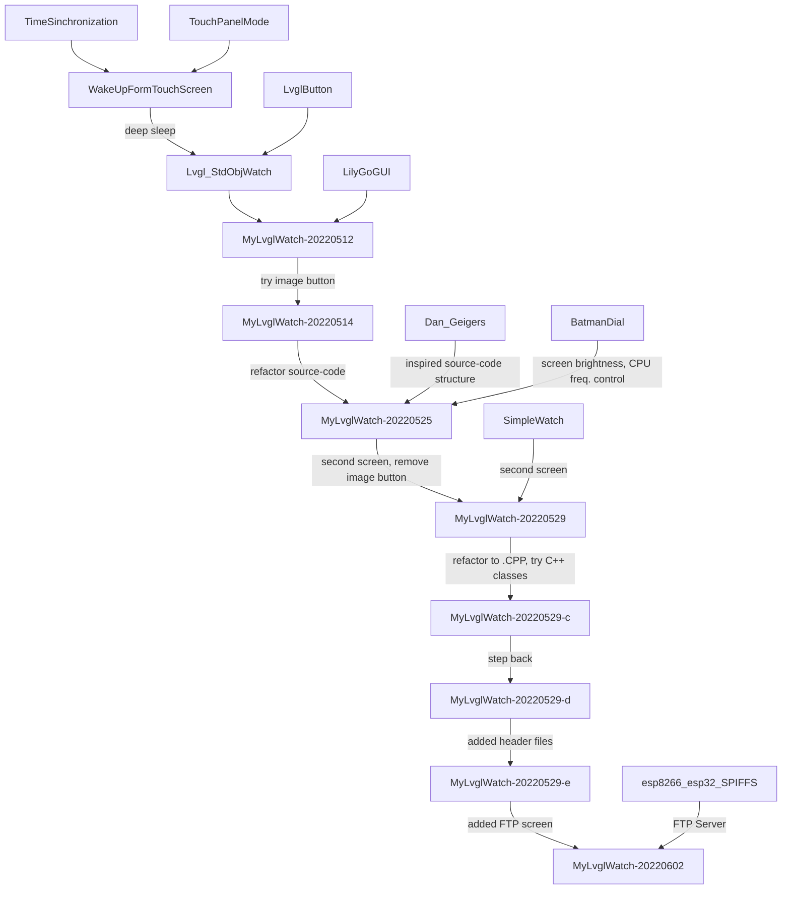

# TTGO T-Watch Experiments

## Presentation

Hi!

My intention is to document and reference experiences/experiments programming TTGO T-Watch V.3 using Arduino IDE.

## Tools and libraries

- Arduino IDE vers. 1.8.16
- TTGO T-Watch Library with (default) LVGL vers. 7.4
- ESP32 board Arduino Library vers. 1.0.6

## Comparing examples

|  | Time Synchronization | Lvgl_base | Batman Dial | LilyGoGUI | Simple Watch | Dan Geiger (from Instructables - ST-TNG inspired screen) |
| --- | --- | --- | --- | --- | --- | --- |
| Display time or date* | YES | No | YES (adjusted through compilation time) | No | YES (adjusted through compilation time) | YES (adjust through compilation time) |
| Set RTC using NTP | YES | No | No | No | No | No |
| Connects to WiFi | YES | No | No | No | YES | No |
| Switches between screens* | No | No | No | No | YES | No |
| Uses FreeRTOS | No | No | No | No | YES | No |
| Uses LVGL | No | YES | YES | YES | YES | YES |
| Uses LVGL Styles | No | No | YES | YES | YES | No |
| Sets alternative fonts using LVGL | No | No | YES | YES | YES | No |
| Sets images using LVGL | No | No | YES | YES | YES(T-WATCH pre-compiled images) | No |
| Attracting feature | Set RTC using NTP, connect to WiFi | Simple use of LVGL | Set display brightness, set CPU clock frequency | One complex screen, many images, many fonts | complex project, One LVGL.screen, many LVGL.containers (Menu, Keyboard), OOP, configure many hardware interrupts (accelerometer, power management), looks careful use of LVGL along side FreeRTOS | Catches touch coordinates directly from tft, draws screen directly to tft. Seems not to use LVGL objects and events. |

*Display time or date* the code gets time from RTC, NTP, local system or other current time source, displays AND updates displayed time.

*Switches between screens* implies that the example is capable of drawing more then one screen: the code redraws the entire display area.  

*NC* means Not Checked.

## My roadmap

1. Explore examples
1. Create a watch that gets time/date from NTP;
2. Test battery duration, use deep sleep, disable display, sensors, use touch wake up.
   - one charge lasted 6.5 days with remaining 7% battery running `MyLvglWatch-20220529-e`;
   - temperature has influence on battery charge readings (desk (approx. 15C) X wrist => 7% => 8%);
   - seems more sensitive to screen brightness than CPU frequency;
      - curious to try out brightness=10, CPUFreq=10 (was brightness=20, CPUFreq=20)
3. Create a watch with (exactly) two screens;
4. (Re)Factor code in order to facilitate project extensions (more screens, more features, ...)
   - LVGL functions expect **C** function pointers as parameters. AFAIK, OOP (**C++**) member functions can not be (re)cast as C function pointers. This might discourage the use of OOP;
5. Create a many screens/features watch;

### Examples 

### Status

`MyLvglWatch-20220602` enters guru meditation when attempting to send file to the watch. Same happens with FTP example running alone in T-Watch.

## Conclusions by now

### Difference between .INO .C and .CPP in multifile sketches in Arduino IDE - ESP32

It seems that .INO are merged and compiled as one large file (*static and external keywords behavior indicate it*). .C files are standard C files (*objects are not allowed*), .CPP are standard C++ files.(Experiments to be presented).

### LVGL and FreeRTOS might not be compatible.

LVGL saves a lot of programmer's work. It handles display devices, touchscreens, display text, image and buttons and handles events, allowing the programmer to build a GUI on the watch.

FreeRTOS is necessary and popular to build multithreaded applications such as web servers on small devices like ESP32.

Unfortunately LVGL documentation indicate that there might be issues when executing it along with FreeRTOS:

From LVGL 7/8 Documentation (https://docs.lvgl.io/master/porting/os.html?highlight=thread%20safe#operating-system-and-interrupts):

> LVGL is not thread-safe by default.

From LVGL 7/8, FreeRTOS is marked as *TODO* https://docs.lvgl.io/master/get-started/os/freertos.html#freertos

## References

1. [TTGO T-Watch library](https://github.com/Xinyuan-LilyGO/TTGO_TWatch_Library). I downloaded it on 2022 May 6th. There is an interesting commit about faster startup on May 10th. 
2. [Markus Wobish blogger blog](https://markus-wobisch.blogspot.com/2021/03/lilygo-ttgo-t-watch-2020-getting.html). I first read it arround 2022 May 7th.
3. [Dan Geiger at Instructables](https://www.instructables.com/Lilygo-T-Watch-2020-Arduino-Framework/). I first read it arround 2022 May 7th.
4. [LVGL V.7.11 documentation](https://docs.lvgl.io/7.11/). I am consulting it from arround 2022 May 12th.
5. [FTP Server for ESP32](https://www.mischianti.org/2020/02/08/ftp-server-on-esp8266-and-esp32)
